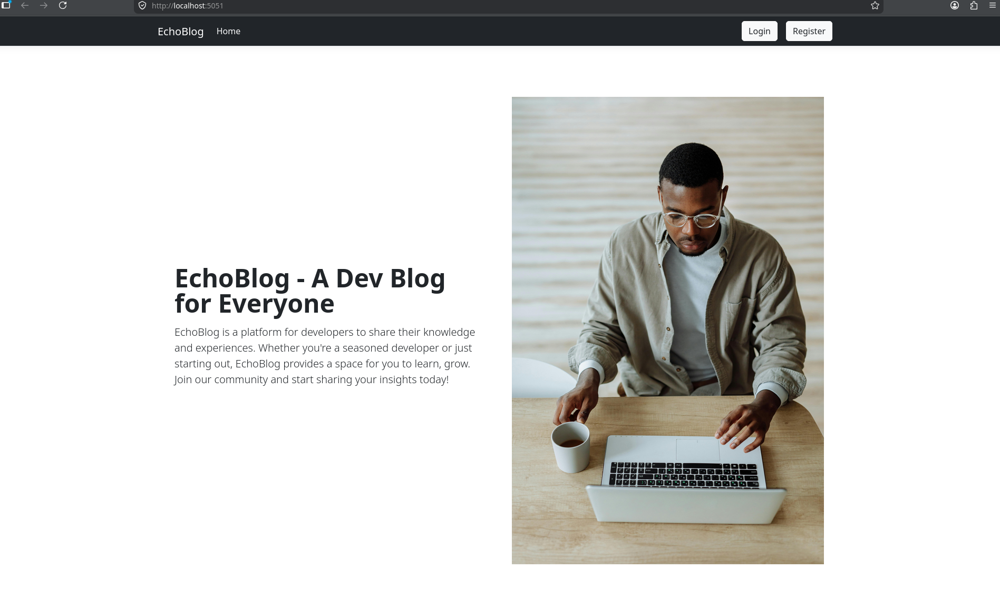

# EchoBlog



EchoBlog is a full-stack ASP.NET Core MVC blogging application built with .NET 10. It includes a public blog experience plus an admin area for managing posts, tags and users. The project uses SQL Server for data storage and ASP.NET Core Identity for authentication and authorization.

## What this project covers

- Public blog listing page with tags and featured content
- Detail view for individual blog posts
- Registered user authentication with login, logout, and register
- Admin area protected by role-based authorization
- Admin CRUD for blog posts, including tag assignment
- Admin management of tags and users, including search/filter, sorting, and pagination for tags
- Like support through an API endpoint
- Persistent data with Entity Framework Core and SQL Server
- Cloudinary image storage integration for featured images

## Core features

### Blog site functionality
- Home page with list of blog posts and available tags
- Blog post details page
- Search-friendly URL handles for post pages
- Visibility flags for draft or published posts
- Comments and likes system support via repositories and API endpoints

### Authentication and authorization
- ASP.NET Core Identity for user management
- Role-based access control (`Admin` only for admin controllers)
- Registration flow assigns new users to the `user` role
- Login, logout, access denied handling

### Admin management
- Create, edit, delete blog posts
- Manage post metadata: heading, page title, content, description, author, publish date, featured image URL, visibility
- Assign tags to posts during add/edit operations
- Manage tags and users in dedicated admin panels

## Architecture and structure

- `Program.cs` sets up services and routing
- `Controllers/` contains MVC controllers for pages and admin operations
- `Data/` contains EF Core DbContext classes for blog data and auth data
- `Repositories/` contains repository interfaces and implementations for blog posts, tags, images, likes, comments, and users
- `Models/` contains domain models and view models used throughout the app
- `Views/` contains Razor views for pages, admin screens, and account flows

## Technologies used

- .NET 10
- ASP.NET Core MVC
- Entity Framework Core with SQL Server
- ASP.NET Core Identity
- CloudinaryDotNet for image handling
- Razor Views

## Setup

1. Restore dependencies

   ```bash
   dotnet restore
   ```

2. Update connection strings in `appsettings.json` or `appsettings.Development.json`
   - `BlogDbConnection`
   - `BlogsAuthDbConnection`

3. Apply database migrations

   ```bash
   dotnet ef database update
   ```

4. Run the application

   ```bash
   dotnet run
   ```

5. Open the app in your browser at the address shown in the console output.

## Notes

- The project expects SQL Server for both the blog database and the identity database.
- Cloudinary is configured through the `IImageRepository` implementation, so featured image upload can be handled in the admin panels.
- User registration currently creates users in the `user` role. Admin roles should be seeded or assigned separately.

## Project files to review

- `Program.cs` — application startup and service registration
- `EchoBlog.csproj` — project dependencies and target framework
- `Controllers/` — request handling and routing
- `Repositories/` — data access logic
- `Views/` — UI templates
- `Data/` — EF Core database contexts

